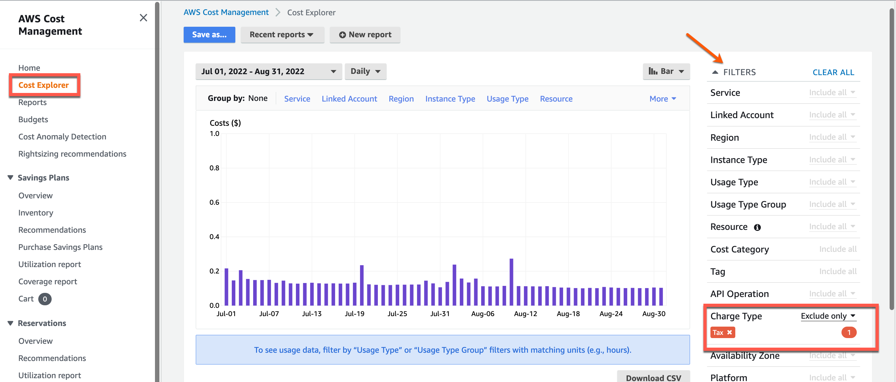

# Guidelines for using cost analysis tools of your CSP

Authorised users can analyse your cloud service cost using the cost analysis tools provided by your CSP.

In this document, as an example, we explain how to analyse your cloud service usage costs using the [billing and cost explorer tools provided by AWS](#to-use-cost-explorer) and identify any mismatch between our billing report and the actual usage.

> **Note**:
>- Refer to [View your agency billing report](#view-your-agency-billing-report) for additional information.
>- The following steps are only a recommendation to verify the GCC 2.0 billing report using the cost management tools provided by your CSP. For detailed instructions on using cost management tools, refer to the CSP documentation.

## How to verify GCC 2.0 billing report using AWS Cost Explorer

1. [Log in to the Cloud Management Portal](log-in-to-cmp). The **Dashboard** displays the available tenant accounts.
2. Locate the required tenant account and click **Manage**.
<kbd></kbd>
3. Click **Launch console**.
<kbd></kbd>

  > **Note**:
  > Alternatively, you can access the AWS console from your AWS cloud account.

4. Go to **AWS Account** to view the available cloud accounts.
5. Choose the required cloud account.
<kbd></kbd>

6. Click **Management console**.
<kbd></kbd>

7. Search for **Cost Explorer** or open it if it is already listed in your Console.

<!--
<kbd></kbd>

7. Search for **Billing** or open it if it is already listed in your Console.

<kbd></kbd>

By default, the console shows the **AWS Billing Dashboard** page. To understand what is displayed on this page, visit [AWS documentation on Billing Dashboard](https://docs.aws.amazon.com/awsaccountbilling/latest/aboutv2/view-billing-dashboard.html).

9. In the navigation pane, choose **Bills**. By default, the current month's bill detail is displayed.

<kbd></kbd>

10. Select the required month in **Date**. The **Summary** section displays the details for that month.

<kbd></kbd>

10. To view and understand your cost usage pattern based on required filter criteria, click **Cost Explorer** from the navigation pane.

<kbd></kbd>

11. Click **Launch Cost Explorer**.

<kbd></kbd>-->

8. On the **AWS Cost Management** page, click **View in Cost Explorer**.
<kbd></kbd>

9. Select the required date range.
<kbd></kbd>

10. Go to **FILTERS** > **Charge Type** and we recommend you to exclude **Tax** apply this filter.
<kbd></kbd>

<!--11. Scroll down below to view the same information in a table format.-->

  > **Note**:
  >- There are other filters by which you can customise as needed and view the related cost for the selected date range.
  >- For more information, visit [AWS documentation](https://docs.aws.amazon.com/cost-management/latest/userguide/ce-what-is.html).
