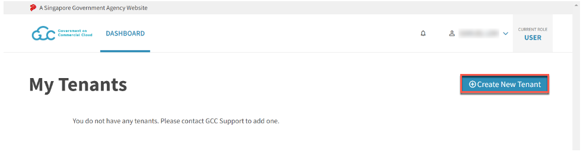
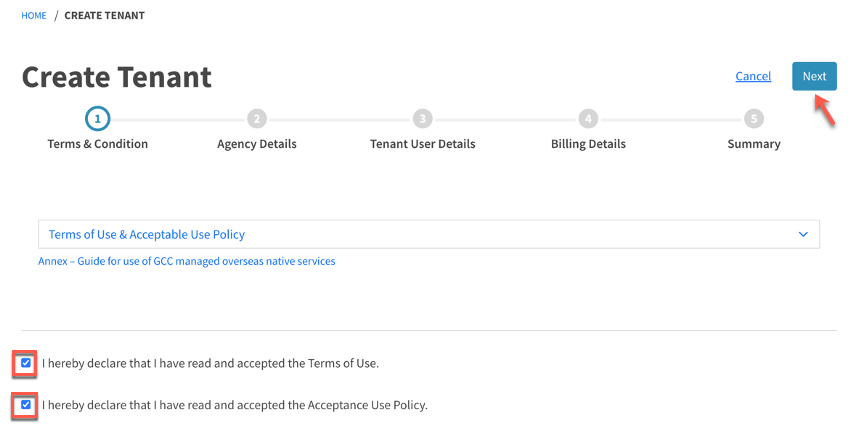
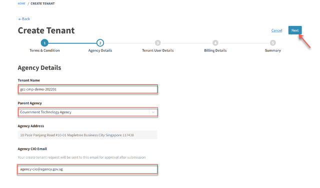
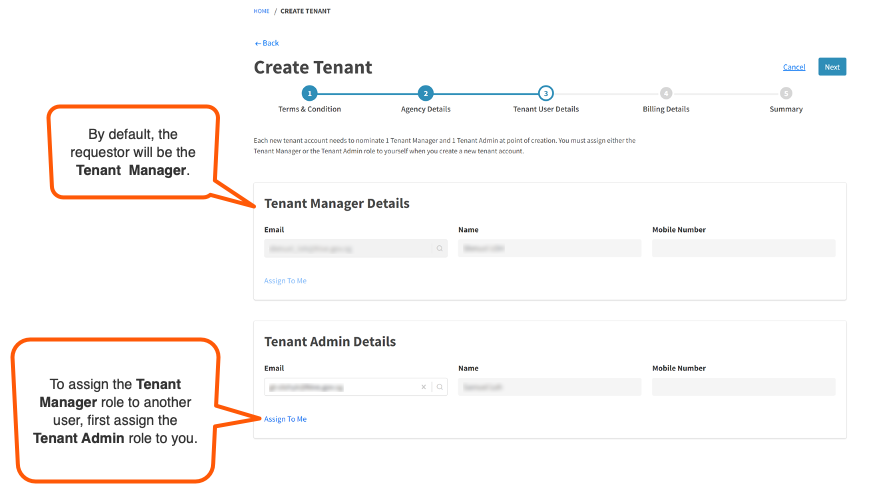
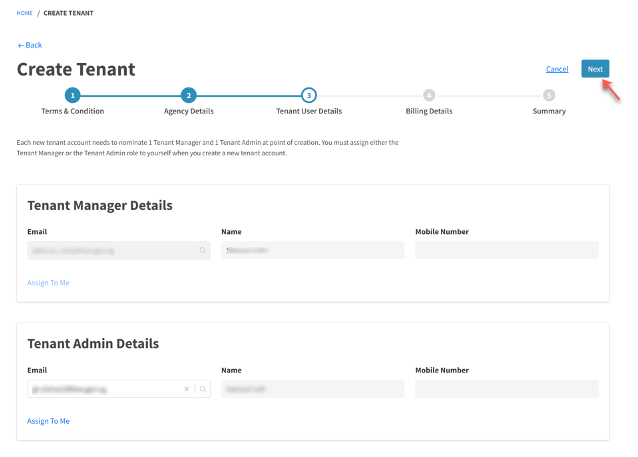
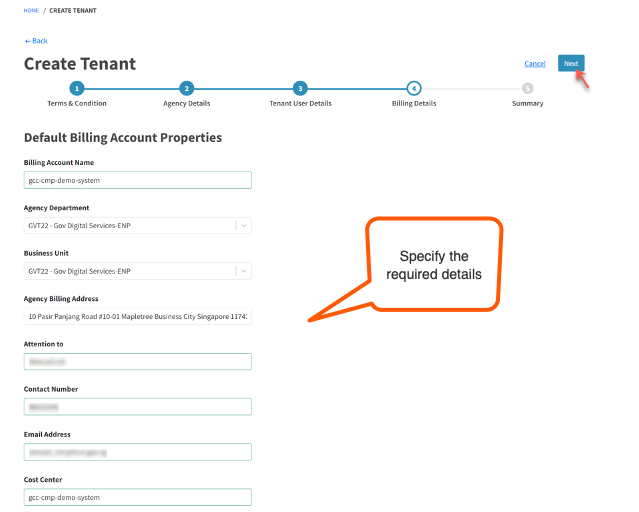
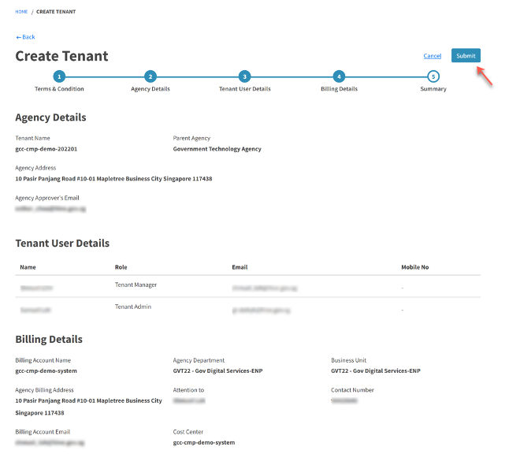
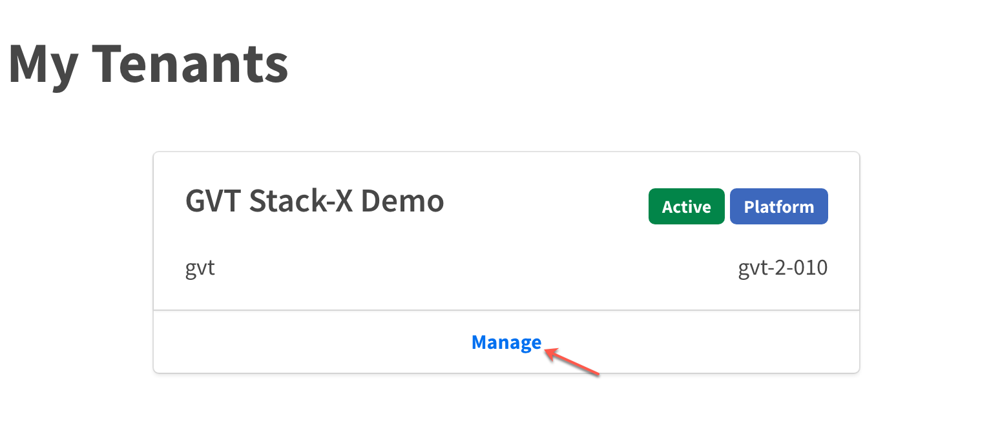

# Create Tenant Account

Agencies can consolidate and centrally manage their cloud accounts using the GCC 2.0 CMP. To do this, agency has to create a tenant account. This has the following workflow:

| 
Workflow stage
  | 
User
 | 
Description
 |
| :------------------------------------------ |:-------------| :------------- |
| [Submit tenant account request](#submit-tenant-account-creation-request) | Tenant Manager | A public officer from your agency who has onboarded to GCC 2.0 initiates the account creation process by submitting the request.  The request is sent to the email address of the Chief Information Officer(CIO) or the designated CIO delegate of the agency for approval. |
| [Approve or reject tenant account creation request](#approve-create-tenant-account-request) | CIO or the designated CIO delegate is the approver | Approver reviews this request and approves or rejects the request via email.  If the request is approved, a tenant account is created and CMP notifies the Tenant Manager or the Tenant Admin via email. |
| [View the newly created tenant account](#view-the-newly-created-tenant-account) | Tenant Manager | Public officer who requested for this account can view the newly created tenant account from the CMP Dashboard. |

## Submit tenant account creation request

The Tenant Manager completes the following steps to initiate the tenant account creation process.

**To submit tenant account creation request**

1. [Log in to the Cloud Management Portal](log-in-to-cmp)

2. In the **Dashboard**, click **Create New Tenant**.

<kbd></kbd>

3. Accept the Terms of Use (TOU), Acceptable Use Policy (AUP) and click **Next**.

<kbd></kbd>

4. Specify the required agency details and click **Next**.

<kbd></kbd>

| 
Field Name
  | Description |
| :------------------------------------------ |:-------------|
| **Tenant Name**      | Enter a human-readable alias name for this tenancy.     |
| **Parent Agency**     | Select your agency name from the drop-down list.     |
| **Agency Address** | Official mailing address of your Agency. This is automatically displayed based on the selected **Parent Agency**. |
| **Agency CIO Email** | Enter the organisation email address of your CIO or the designated CIO delegate who is authorised to approve the tenant creation request. |

?> The requesting public officer must be either a **Tenant Manager** or a **Tenant Admin** for this account. By default, the public officer requesting this tenant account is assigned as the **Tenant Manager**. You can add additional tenant users after the Tenant Account is approved.

5. To assign a **Tenant Admin**, go to **Tenant Admin Details** section and choose one the following steps:

      - To assign the role to a different user, enter the organisation email address of the public officer in **Email**.
      - To assign the role to yourself, click **Assign To Me** and nominate a different user for the **Tenant Manager** role.

<kbd></kbd>

| 
Field Name
  | Description |
| :------------------------------------------ |:-------------|
| **Tenant Manager Details**                  | This section displays the organisation email address, full name and handphone number(if available) of the **Tenant Manager**. By default, the public officer requesting this tenant account is assigned as the **Tenant Manager**. |
| &nbsp;&nbsp;&nbsp;&nbsp;**Email**                                |   By default, this displays the TechPass ID(organisation email address) of the requestor. Requestors can assign this role to a different user, provided they first assign the **Tenant Admin** role to themselves. To assign the **Tenant Manager** role to a different user, enter the TechPass ID of the required public officer.                                                   |
| &nbsp;&nbsp;&nbsp;&nbsp;**Name**                                    |   Displays the full name of the **Tenant Manager**.                                                       |
| &nbsp;&nbsp;&nbsp;&nbsp;**Mobile Number**   | Displays the handphone number of the **Tenant Manager** if available.                                                    |
| &nbsp;&nbsp;&nbsp;&nbsp;**Assign To Me**                            |   This option is enabled only if the **Tenant Manager** role is currently assigned to a different user. Click this to assign the **Tenant Manager** role to yourself. |
| **Tenant Admin Details**                    |   This section allows requestor to assign a **Tenant Admin** for this account. |
| &nbsp;&nbsp;&nbsp;&nbsp;**Email**                                   |   By default, this field is blank.  To assign this role to a user, enter the TechPass ID (organisation email address) of the required public officer. |
| &nbsp;&nbsp;&nbsp;&nbsp;**Name**                                    |   Displays the full name of the assigned **Tenant Admin**. |
| &nbsp;&nbsp;&nbsp;&nbsp;**Assign To Me**                            |   As a requestor, you can assign the **Tenant Admin** role to yourself by clicking this option. |  

6. Click **Next**.

<kbd></kbd>

7. Specify the required details for the billing account and click **Next**.

<kbd></kbd>

| 
Field Name
   | Description |
| :------------- |:-------------|
| **Billing Account Name**      | Enter a human-readable alias name for this billing account. This is to make it easy for the agencies to identify a billing account.    |
| **Agency Department** | Select the department to be billed for this tenant account. |
| **Business Unit** | Select the business unit to be billed for this tenant account.|
| **Agency Billing Address** | This is the official mailing address of your agency and is displayed automatically based on the **Agency Details** provided earlier. |
| **Attention To** | Enter the full name of the public officer who receives the invoice for this tenant account. |
| **Contact Number** | Enter the phone number of the public officer who receives the invoice. |
| **Email Address** | Enter the TechPass ID (organisation email address) of the public officer who receives the invoice. |
| **Cost Center**  | This is applicable only for GovTech tenant accounts. Enter the cost center code for your agency. This code should be used by the Finance for internal GovTech inter-department charging/journal entry.|
| **Payment Mode (for agencies)** | This is applicable for agencies other than GovTech. Choose one of the following payment modes. <ul><li>GIRO - Choose this to auto debit the billing amount from your agency's designated bank account on the invoice due date.</li><li>PUBBS (Payment Under Block Billing System) - Choose this to auto debit the billing amount from the account activated on the PUBBS Portal. The billing amount is deducted in two instalments with the first and second instalment dates falling on 15th and 24th of every month.</li><li>Interbank Transfer - Choose this to make the payment only after your agency initiates the payment.</li> |

?> To view the complete list of agency departments and business units, refer to the [Vendors@Gov website](https://www.vendors.gov.sg/UsefulReferences/MinStatuaryBoards.aspx).

9. Make sure the information displayed on this page is correct and click **Submit**.

<kbd></kbd>

The agency's CIO or the CIO delegate receives an email notification to process this request.

## Approve create tenant account request

The agency CIO or the designated CIO delegate reviews request details before approving or rejecting the tenant account creation via email.

**To approve or reject a tenant account creation request**
1. Open the email that notified you about the new tenant account creation request.
2. Review the submitted request details enclosed in this email.
3. Click **Reply** on the email and in the first line of your reply enter one of the supported response words.

| 
Approval words
  | 
Rejection words 
|
| :------------- |:-------------|
| APPROVE | REJECT |
| APPROVED | REJECTED |
| YES | NO |

4. Optionally, in the second line, add your comments.
5. Click **Send**.

CMP is notified about the approval or rejection. If the request is approved, the requested tenant account is created and the **Tenant Manager** who requested this account is notified via an email.  

## View the newly created tenant account

Once the new tenant account is created, the tenant manager who requested for this account is notified via email.

**To view the newly created tenant account**
1. [Log in to the Cloud Management Portal](log-in-to-cmp).

2. In the **Dashboard**, the newly created tenant account is displayed.

<kbd></kbd>
