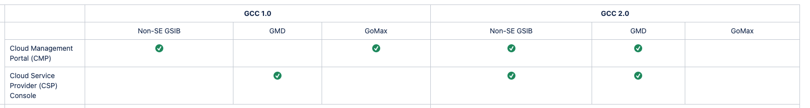

# User devices

This sections summarises user devices' compatibility for GCC 1.0 and GCC 2.0.

<!---->
**GCC 1.0**

|  Non-SE GSIB |   GMD | GoMax |
| :-------------: |:-------------:|:-------------: |
| Yes | No|  Yes |

**GCC 2.0**

|  Non-SE GSIB |   GMD | GoMax |
| :-------------: |:-------------:|:-------------: |
| Yes| Yes | No|
