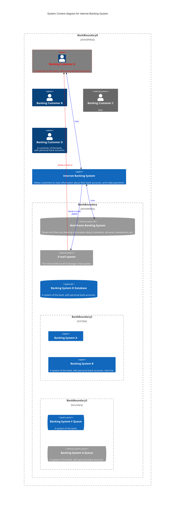

# GCC glossary
**Cloud Admin**
Public officers and vendors or contractors can be assigned as a Cloud Admin. They can access the cloud console or Portal from GCC 2.0 CMP to do the following:
- manage cloud configuration
- manage cloud resources.

**Cloud Assume Role**
Users with this role can access the cloud console or Portal to create custom IAM roles for their agencies.

**Cloud Billing**
Public officers and vendors or contractors can be assigned as a cloud billing admin who can access the cloud console or Portal from GCC 2.0 CMP to administrate billing operations of the CSP account.

**Cloud Developer**
Users with this role have administrative access with few limitations defined for IAM, Security and Networking.

**Cloud Ops**
While this user has operations permissions and can control resources, they can't increase their own privileges or change networking frameworks.

**Cloud Network Admin (Internet)**
This user can access the cloud console or Portal from GCC 2.0 CMP to do the following:
- manage day-to-day VPC level networking tasks such as create and maintain connectivity and infrastructure including manage routing, subnets, VPCs and VPC endpoints.
- create and maintain connectivity external to VPCs and accounts including, Amazon Virtual Private Network (VPN), Internet Gateways (IGW), and AWS Direct Connect.

**Cloud Network Admin (Intranet)**
This user can access the cloud console or Portal from GCC 2.0 CMP to manage day-to-day VPC level networking tasks such as creating and maintaining connectivity and infrastructure including managing routing, subnets, VPCs and VPC endpoints.

**Cloud Security Auditor**
This user has a read-only access to log data and other configuration data of your cloud resources.

**Cloud SIRO**
Only public officers can be assigned as a Cloud SIRO. They can access the cloud console or Portal from GCC 2.0 CMP to manage security findings from services such as AWS Security Hub.

Security incident response permission set used in the case of a cyber investigation and/or incident response triage. This permission set should not have full administrative access, but rather it should have least privilege access to conduct a cyber investigation.

**Cloud Support**
This is a AWS SSO federated permission set with read-only access to all resources.

**CSP Account**
Cloud service provider account.

**DEEP**
Developers' environment endpoint posture. This is the brains behind the posture attestation.

**GFE**
Government furnished equipment is a device issued by a government agency.

**GMD**
Government managed device. An internet device provided by government agency or a vendor when onboarded to SEED becomes a government managed device.

**GSIB**
Government standard image build is a standard operating environment (SOE) device issued by government. There are two types of GSIB devices: SE GSIB and non-SE GSIB devices.

**TechPass**
[TechPass](https://docs.developer.tech.gov.sg/docs/techpass-user-guide/#/) is an Identity & Access Management (IAM) and  a single sign-on(SSO)solution to seamlessly access Singapore Government Technology Stack(SGTS) services.

**TechPass ID**
This is used to log in to your TechPass account.

- For public officers, it is your WOG ID.
- For vendors, it is *your_name@techpass.gov.sg*.

**Tenant Admin**
Administrator of the GCC2.0 Tenant Account. By default, each tenant account will have one Tenant Manager. Only a public officer can be a Tenant Admin.
Tenant Admin can do the following:
- submit requests to add additional tenant account users
- manage the tenant account users and their roles
- manage tenant billing accounts
- create and manage CSP account users and their console or Portal roles.

**Tenant Billing Admin**
Administrator of Tenant Billing Accounts. Tenant Billing Admin can manage tenant billing account details.

This is an optional role for tenant accounts and may be assigned to a public officer if your agency wants a dedicated staff to manage the billing.

**Tenant Manager**
Owner of the GCC2.0 Tenant Account who approves requests raised by other tenant users using the GCC 2.0 CMP. Only a public officer can be a Tenant Manager. By default, each tenant account will have one Tenant Manager.

Tenant Admins can submit a request to add the second Tenant Manager. Though Tenant Managers can perform all the actions available to other tenant roles, they can submit requests only if there is more than one Tenant Manager for the tenant account.

**Whole of Government(WOG) ID**
WOG ID is the email address belonging to the gov.sg domain. For example, *your_name@tech.gov.sg* or *your_name@mof.gov.sg*. Public officers who onboard to SEED must have a WOG ID or account.

