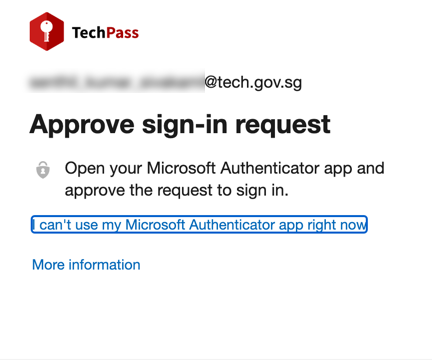

## Log in to the Cloud Management Portal

1. From a non-SE GSIB or GMD, log in to the [GCC 2.0 Cloud Management Portal](https://cmp.gcc.gov.sg).
2. Choose or enter your TechPass account.

<kbd></kbd>

3. If you are accessing the CMP from a GMD, you will be prompted to authenticate your WOG account. Enter the One-time password code displayed on the Authenticator app for your SG Govt M365 profile and click **Sign in**.

<kbd></kbd>

You will now be prompted to approve your TechPass sign-in.

<kbd></kbd>

4. On the Authenticator app, tap **APPROVE** to authenticate your TechPass sign-in.
5. Click **Login with TechPass**.

<kbd></kbd>

You are now successfully logged in to the CMP.
