# Manage tenant account users

**Prerequisites:** [GCC 2.0 tenant account](create-tenant-account).

Tenant Manager and Tenant Admin can do the following:

- [View tenant account users](#view-tenant-account-users)
- [Submit additional tenant account user request](#submit-additional-tenant-account-user-request)
- [Retract additional tenant account user creation request](#retract-additional-tenant-account-user-request)
- [Approve or reject additional tenant account user request](#approve-or-reject-additional-tenant-account-user-request)

## View tenant account users

Tenant Manager and Tenant Admin can view and manage the tenant account users.

**To view and manage tenant account users**:
1. From the **Dashboard**, go to the required tenant account and click **Manage**.
2. Select **Users**.
3. You may do the following:
   - [Submit additional tenant account user request](#submit-additional-tenant-account-user-request).
   - Delete a user from this tenant by clicking the trash icon in that row.

<kbd>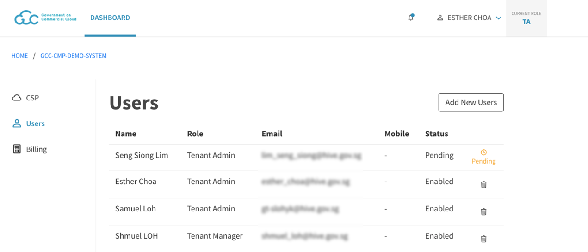</kbd>   

> **Note:**
>
> User status can be any of the following and they indicate:
>- Enabled - User belongs to this tenant account.
>- Pending - Request to add the user to this tenant account is pending to be processed.

## Submit additional tenant account user request

When a tenant account is created, it will have only two users, and they are the Tenant Manager and Tenant Admin. The Tenant Admin and Tenant Manager can add and manage additional users.

> **Note:** Tenant Managers can submit a request to add additional tenant users provided there are more than one Tenant Manager for the account as the request has to be approved by another Tenant Manager.

**To add additional users to a tenant account**

1. From the **Dashboard**, go to the required tenant account and click **Manage**.
2. Go to **Users** and click **Add New Users**.
<kbd>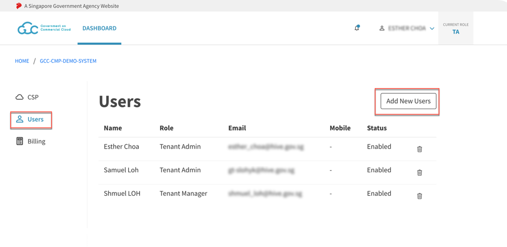</kbd>
3. On the **Add Users** page, specify the required details and click **Next**.

| 
Field Name
  | Description |
| :------------------------------------------ |:-------------|
| **Role**      | Select a role for the tenant user. Following are the cloud roles available in the CMP portal:    - Tenant Admin - Tenant Manager - Tenant Billing Admin.   Refer to the [Glossary](glossary) to know more about these roles and their responsibilities.  |
| **Email**     | Type the first few characters of the user's email address registered with TechPass and select the required email address from the matching results.   - You can add users who have an active TechPass account.  - If you can't locate user by entering the email address, verify if the user has an active TechPass account. |
| **Name** | Displays the user name based on the **Email**. |
| **Phone Number** | Displays the phone number of the user if available. |
| **Add another user** |  Click this to add another user. |

  <kbd>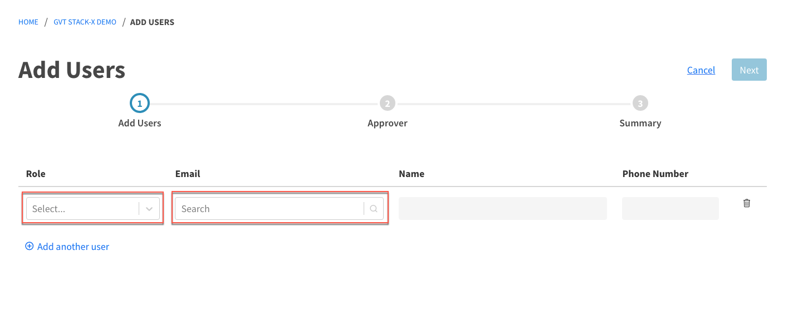</kbd>

4. Select at least one Tenant Manager as the approver and if needed, specify additional information in **Remarks**.
5. Click **Next**.
 <kbd>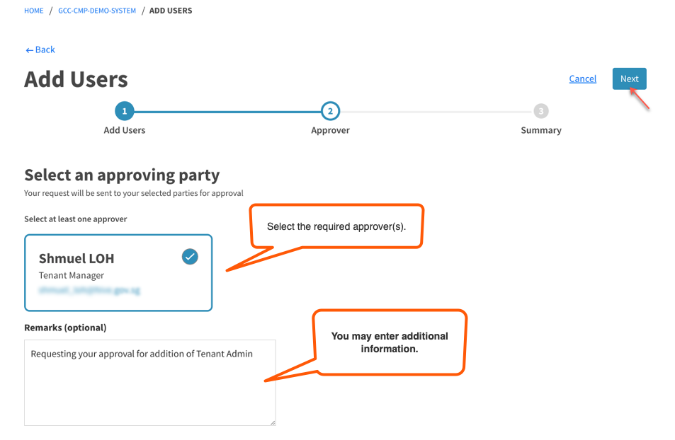</kbd>

6. Review the request **Summary** and to change the **Tenant User Details** or the **Approving Party**, click the **Edit** link.

  <kbd>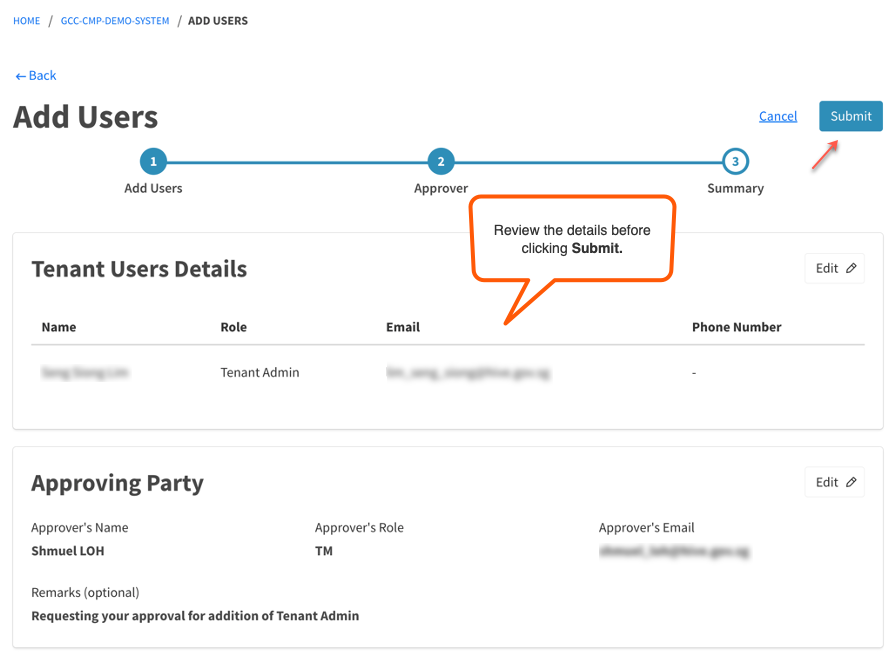</kbd>
7. Click **Submit**. The status of the users requested to be added will be **Pending** until the request is approved.

>- **Note:** Requestor can [cancel or retract an additional user creation request](#retract-additional-tenant-account-user-request) if it is not yet been processed.

## Retract additional tenant account user request

Requestor may retract a request as long as it is not been processed by the assigned approver. Some of the possible reason for retracting a request are:
- requested approvers are not available
- requestor wants to assign a different approver
- request is no longer valid.

When you retract a request, you may have to provide a reason for retracting the request and the request status changes from **Pending** to **Cancelled** and will be listed under **Notifications** > **Approvals** > **Cancelled**.

**To retract the additional tenant account user request**
1. Go to notifications  > **Approvals**.
<kbd>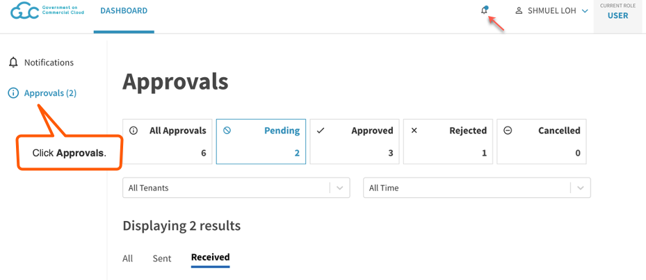</kbd>
2. Select **Pending** and then go to the **Sent** tab to view requests submitted by you and pending approval.
<kbd>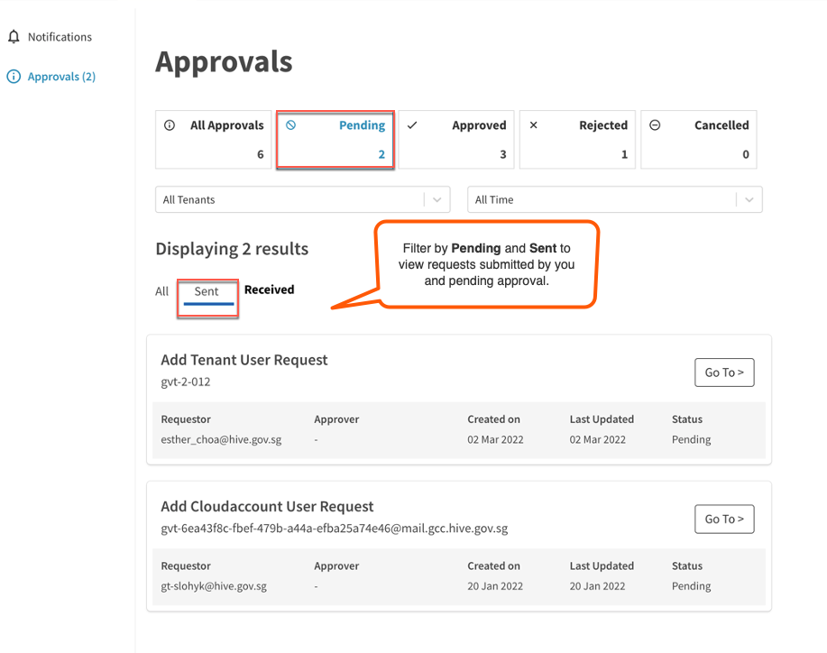</kbd>
3. Locate the request you want to retract and click **Go To**.
<kbd></kbd>
4. Verify the request details and click **Retract**.
<kbd>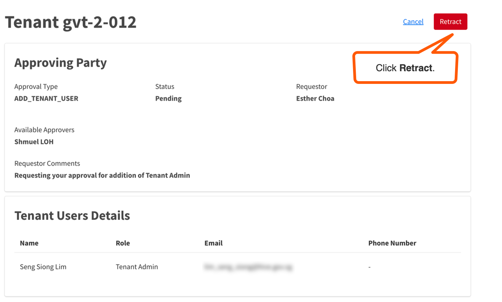</kbd>

## Approve or reject additional tenant account user request

When a request to add tenant account users is submitted, the assigned Tenant Manager(s) receive an email notification to process the request.

> **Note:**
> A request is considered to be processed if one of the assigned Tenant Manager approves or rejects the request.

**To approve or reject the additional tenant account user request**

1. [Log in to the Cloud Management Portal](log-in-to-cmp) as **Tenant Manager**.
2. Go to notifications  > **Approvals**.
<kbd></kbd>
3. Select **Pending** and then go to the **Received** tab to view requests that are waiting for your approval.
4. Locate the required request for adding users and click **Go To**.
<kbd>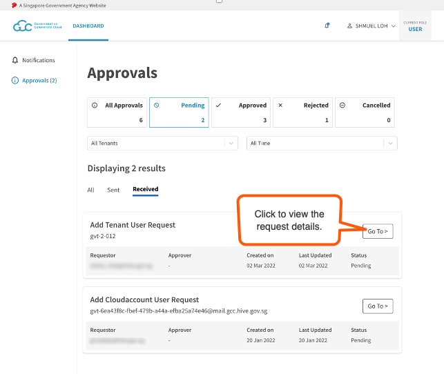</kbd>
5. Review the request details and enter your comments in **Approver Comments**.
6. Select **Accept** or **Reject** as needed.
<kbd>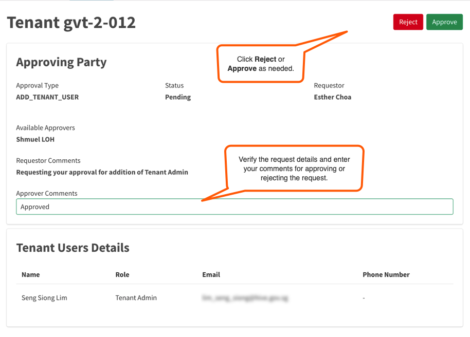</kbd>

  The requestor receives an email notification about the approval or rejection. If a request is approved, the new users get added to the tenant account and their status changes from **Pending** to **Enabled**.

  <kbd>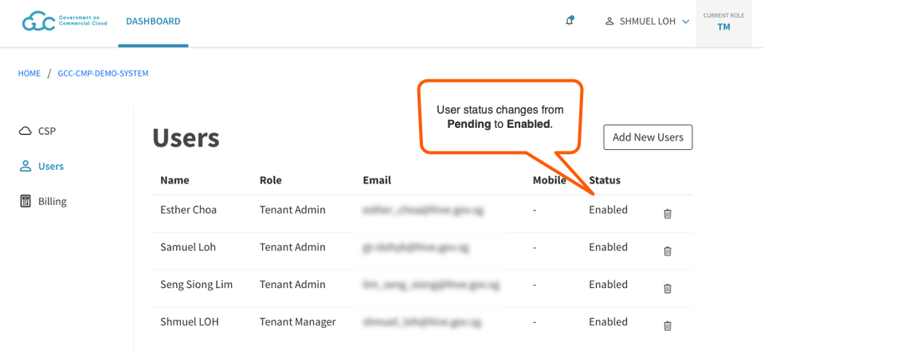</kbd>

**Next steps:**  
- [Create CSP account](create-csp-account)
- [Manage CSP account](manage-csp-account-users)
