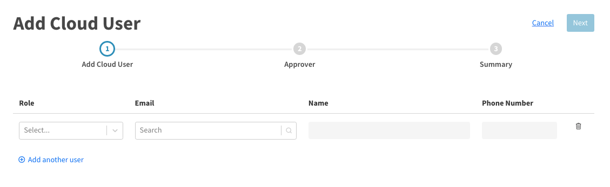
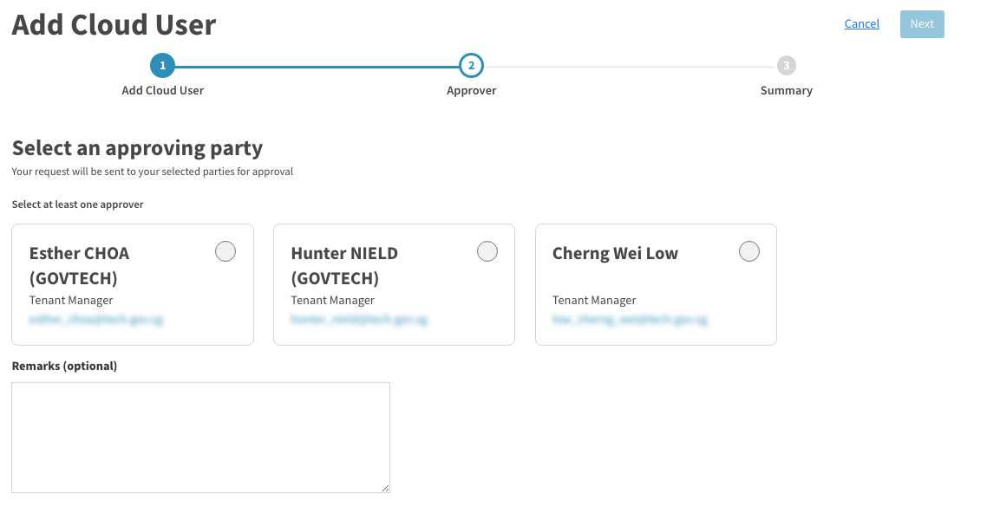
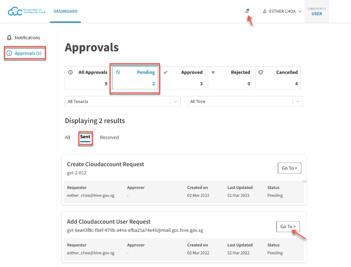
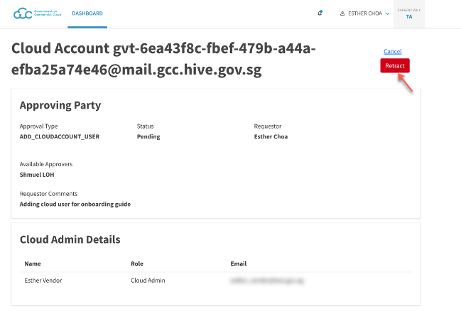
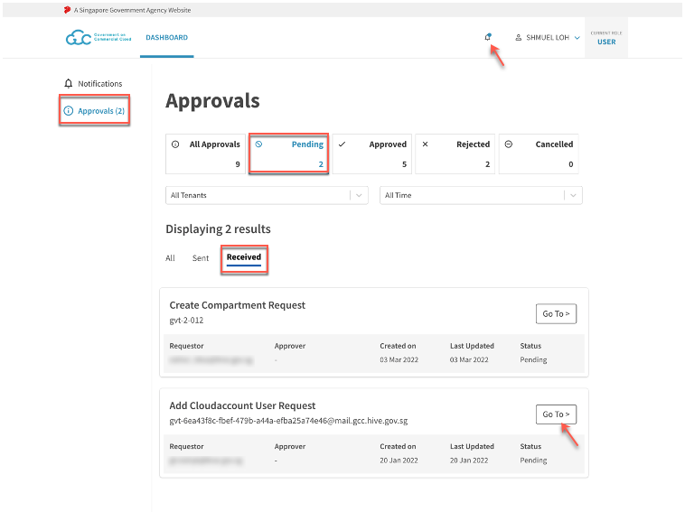
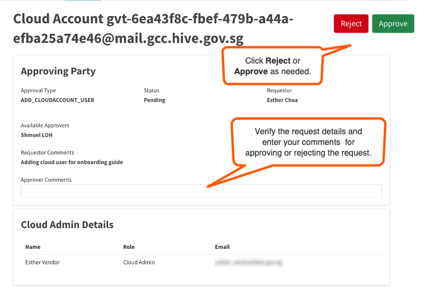

# Manage CSP account users

Tenant Admin and Tenant Manager can do the following tasks:
- [View CSP account users](#view-csp-account-users)
- [Submit a request to add CSP account users](#submit-a-request-to-add-csp-account-users)
- [Retract CSP account user request](#retract-CSP-account-user-request)
- [Approve or reject a add CSP account user request](#approve-or-reject-a-add-csp-account-user-request)

## View CSP account users
Tenant Manager and Tenant Admin can view and manage CSP account users.

**To view and manage CSP account users**:
1. Log in to the [Cloud Management Portal](log-in-to-cmp). The **Dashboard** displays the available tenant accounts.
2. Locate the required tenant account and click **Manage**.
3. Select **Users** to view the list of users.
4. You may do any of the following:
   - [Submit request to add cloud users](#submit-request-to-add-cloud-users).
   - Delete a user from this CSP account by clicking the trash icon in that row.

## Submit a request to add CSP account users
Tenant Admin and Tenant Manager can add users to a CSP account.

> **Note:**
> Tenant Manager can submit this request only if there is more than one Tenant Manager for this tenant account.

**To submit a request to add CSP account users**
1. [Log in to the Cloud Management Portal](log-in-to-cmp).
2. Locate the required tenant account and click **Manage**. Available CSP accounts are listed on the **CSP Accounts** page.
3. Locate the required CSP account and click **Manage**.
4. Go to **Cloud Users** and click **Add Cloud Users**.
5. In the **Add Cloud User** page, specify the required details for the required users and click **Next**.

| 
Field Name
  | Description |
| :------------------------------------------ |:-------------|
| **Role**      | Select a role for the cloud user.     |
| **Email**     | Type the first few characters of the TechPass ID, and select the required TechPass ID from the matching results.   - You can add users who have an active TechPass account.  - If you can't locate user by entering the email address, verify if the user has an active TechPass account.  |
| **Name** | Displays the user name based on the TechPass ID selected as **Email**. |
| **Phone Number** | Displays the phone number of the user if available. |
| **Add another user** |  Click this to add another user. |

<kbd></kbd>

6. Select at least one Tenant Manager as the approver and if needed, specify additional information in **Remarks**.
7. Click **Next**.

<kbd></kbd>

9. Review the request details and click **Submit**.
 > **Note:**
 >- To modify the details, click the required **Edit** links.
 >- The assigned approvers will be notified via email to process the request.
 >- To track the status of your submitted requests, go to Notifications > **Approvals** and filter the list by **Pending** and **Sent**.

## Retract CSP account user request
Requestor may retract a request and CMP allows this if the request is yet to be processed. Some of the possible reason for retracting a request are:
- requested approvers are not available
- requestor wants to assign a different approver
- request is no longer valid.

When you retract a request, you may have to provide a reason for retracting the request and the request status changes from **Pending** to **Cancelled** and will be listed under **Notifications** > **Approvals** > **Cancelled**..

**To retract CSP account user request**
1. [Log in to the Cloud Management Portal](log-in-to-cmp).
1. Go to notifications  > **Approvals**.
1. Select **Pending** and then go to the **Sent** tab to view requests submitted by you and pending approval.
1. Locate the request and click **Go To**.

<kbd></kbd>

5. Verify the details and click **Retract**.

<kbd></kbd>

## Approve or reject a add CSP account user request
When authorised users submits a request to add cloud users to a CSP account, they assign the request to Tenant Manager(s) for approval. Assigned Tenant Managers receive an email notification to process the request.

**Authorised users:** Assigned Tenant Managers.

> **Note:**
> A request is considered to be processed if one of the assigned Tenant Manager approves or rejects the request.

**To approve or reject CSP account user request**

1. [Log in to the Cloud Management Portal](log-in-to-cmp).
1. Go to notifications  > **Approvals**.
1. Select **Pending** and then go to the **Received** tab to view requests that are waiting for your approval.
1. Locate the required request and click **Go To**.
<kbd></kbd>
1. Review the request details and enter your comments in **Approver Comments**.
1. Select **Accept** or **Reject** as needed.
<kbd></kbd>

>**Note:**
>- The requestor receives an email notification about the approval or rejection of the CSP account creation.
>- If a request is approved, the new users are added to the CSP account and their status changes from **Pending** to **Enabled**.
>- After the cloud users are added to the CSP account, it may take up to one hour to assign all the access rights to a newly created CSP user account. So as a cloud user, if you are facing difficulties to launch your console or Portal of your cloud service provider, try again after sometime.
