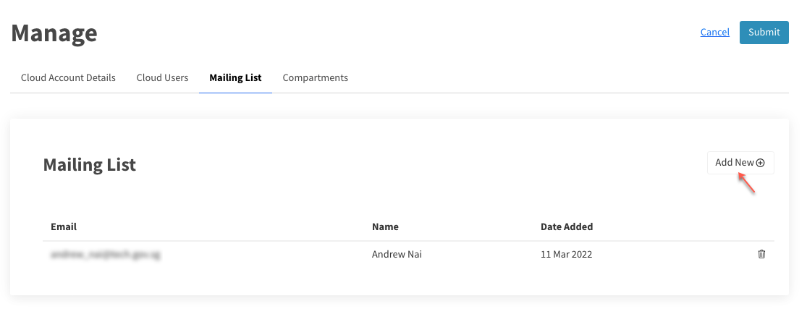
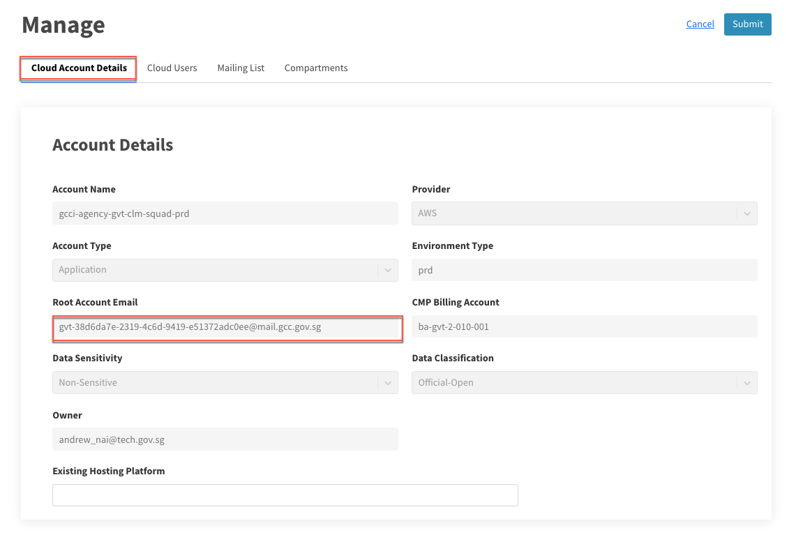
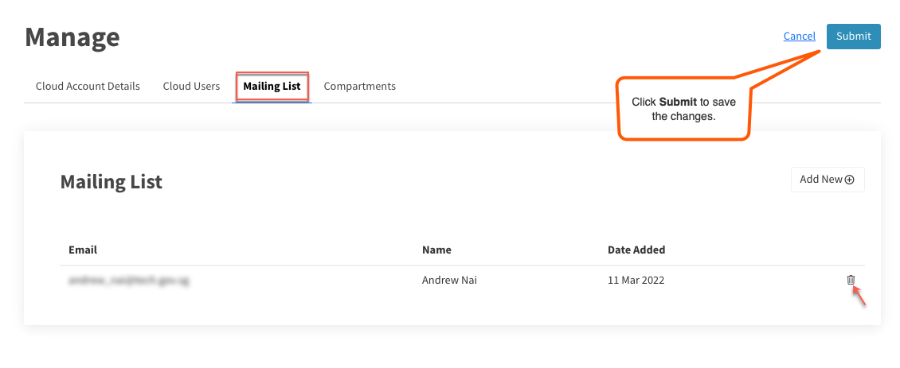

## Manage root email mailing list

When you create an AWS account you need a root account email for your cloud account. In GCC 2.0, this root account email is automatically created as the mailing list for AWS Simple Email Service (SES). Hence, there is no need for agencies to apply for a dedicated single mail account for each cloud account.

Tenant Manager and Tenant Admin of the tenant account can manage the recipients in this root account mailing list.

- [Add recipients to mailing list](#add-recipients-to-mailing-list)
- [Verify your mailing list recipients](#verify-your-mailing-list-recipients)
- [Remove recipients from mailing list](#remove-recipients-from-mailing-list)

## Add recipients to mailing list
1. Log in to the [Cloud Management Portal](log-in-to-cmp). The **Dashboard** displays the available tenant accounts.
2. Locate the required tenant account and click **Manage**. Available CSP accounts are listed on the **CSP Accounts** page.
3. Locate the required CSP account and click **Manage**.
4. Go to **Mailing List** > **Add New**.
<kbd></kbd>
5. In **Add Members to Mailing List**, choose one of the following:
  - To add a single user, click **Add New**, enter the official email address of the user and click **Confirm**.
  - To add more than one user, click **Add Multiple At Once**, enter the official email address of the users, use a comma to separate the email addresses and click **Add**.
<kbd></kbd>  
6. Click **Submit**.
<kbd></kbd>

## Verify your mailing list recipients
1. Log in to the [Cloud Management Portal](log-in-to-cmp). The **Dashboard** displays the available tenant accounts.
2. Locate the required tenant account and click **Manage**. Available CSP accounts are listed on the **CSP Accounts** page.
3. Locate the required CSP account and click **Manage**.
4. Go to **Cloud account Details** and copy the **Root Account Email** displayed.
5. Using your GSIB device, send a test email from your organisation email address to this root account email. Recipients of this mailing list should receive this test email.
<kbd></kbd>

## Remove recipients from mailing list
1. Log in to the [Cloud Management Portal](log-in-to-cmp). The **Dashboard** displays the available tenant accounts.
2. Locate the required tenant account and click **Manage**. Available CSP accounts are listed on the **CSP Accounts** page.
3. Locate the required CSP account and click **Manage**.
4. Go to the **Mailing List**.
5. To remove a user, click the trash icon in that row.
6. Click **Submit**.

<kbd></kbd>
