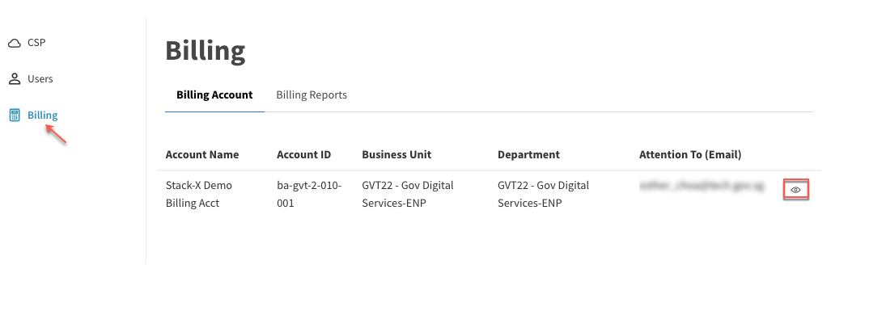
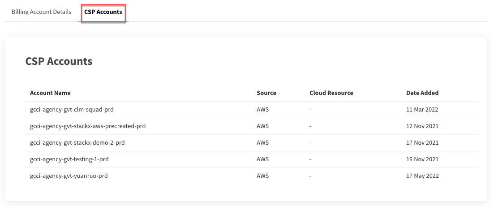
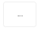
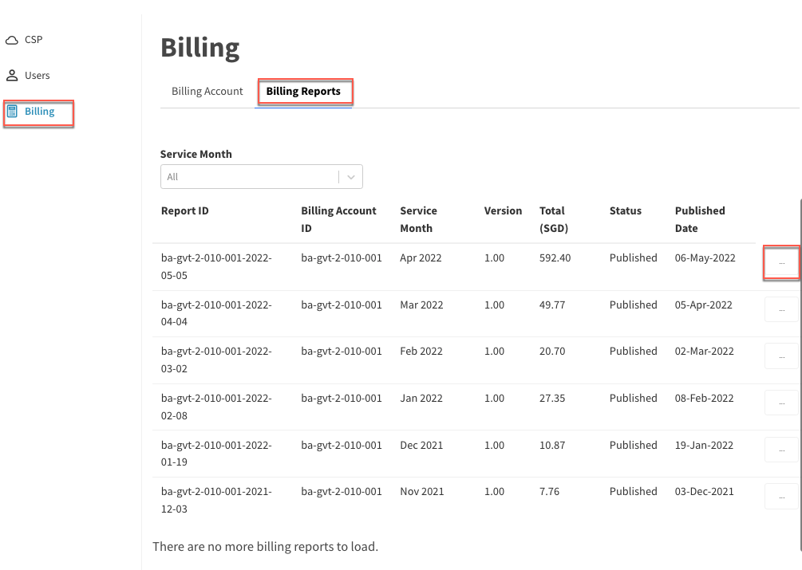

## Manage tenant billing account

Tenant Manager, Tenant Admin and Tenant Billing Admin of the tenant account can manage the billing account.

- [View tenant billing account details](#view-tenant-billing-account-details)
- [Download tenant billing account report](#download-tenant-billing-account-report)

## View tenant billing account details
1. [Log in to the Cloud Management Portal](log-in-to-cmp). The **Dashboard** displays the available tenant accounts.
2. Locate the required tenant account and click **Manage**.
3. Select **Billing** to view the **Billing Account** list.
<kbd></kbd>
4. Locate the required billing account and click the **view** icon in that row. **Billing Account Details** are displayed.
5. Click **CSP Accounts** to view the list of CSP accounts charged under this billing account.
<kbd></kbd>

## Download tenant billing account report
1. [Log in to the Cloud Management Portal](log-in-to-cmp). The **Dashboard** displays the available tenant accounts.
2. Locate the required tenant account and click **Manage**.
3. Select **Billing** and go to **Billing Reports**.
4. Locate the required billing report and click the ellipsis button  in the row.

> **Tip:** To narrow down your search, filter the reports by **Service Month**.

5. Download the billing report.

<kbd></kbd>

> **Note:**
> Currently, you can download the billing report in XLSX format.
