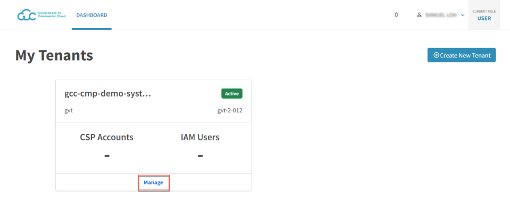
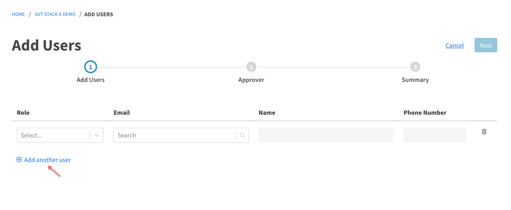
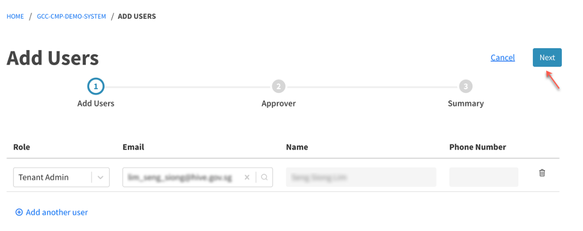
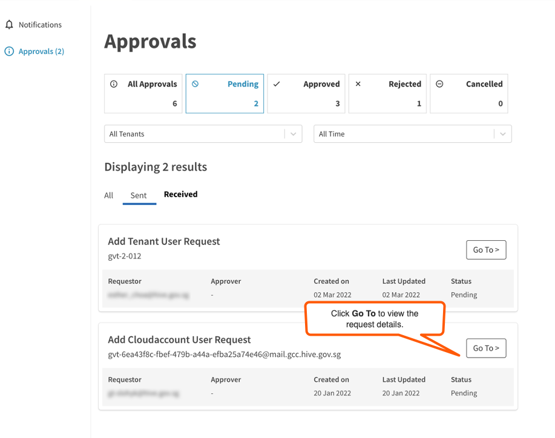
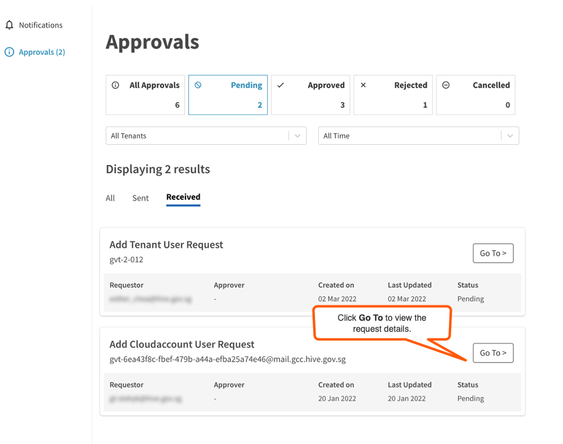
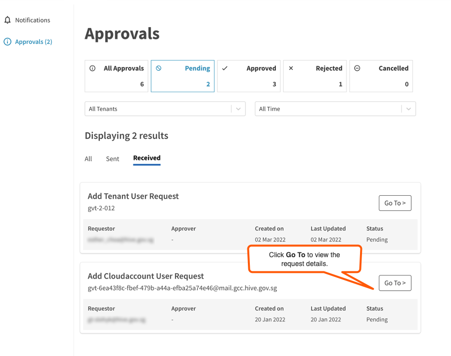

# Manage tenant account users
Tenant Manager and Tenant Admin manage tenant accounts and their users. Generally, Tenant Admin submits requests to add tenant account users and assigns a role to them. The Tenant Manager approves these requests.

| 
Workflow stage
  | 
User
 | 
Description
 |
| :------------------------------------------ |:-------------| :------------- |
| [Submit additional tenant account user request](#submit-additional-tenant-account-user-request) | Tenant Manager or Tenant Admin | Tenant Manager or Tenant Admin can add and manage additional users for the account.    Note: Tenant Managers can submit this request provided there are more than one Tenant Manager for the account as the request has to be approved by another Tenant Manager|
| [Retract additional tenant account user request](#retract-additional-tenant-account-user-request) | User who submitted the request | User who submitted the request can cancel a request as long as it is not been processed. |
| [Approve or reject additional tenant account user request](#approve-additional-tenant-account-user-request)| Tenant Manager | Assigned Tenant Managers receive an email notification to process the request.|
| [View tenant account users](#view-tenant-account-users) | Tenant Manager and Tenant Admin | Tenant Manager and Tenant Admin of this account can view and manage users of a tenant account.|

## Submit additional tenant account user request
While creating a tenant account, it is possible to assign only two users to it, and the two roles are the Tenant Manager and Tenant Admin. Once a tenant account is approved, the Tenant Admin can add and manage additional users.

> **Note:** Tenant Managers can submit this request provided there are more than one Tenant Manager for the account as the request has to be approved by another Tenant Manager.

**To add additional users to a tenant account:**

1. [Log in to the Cloud Management Portal](log-in-to-cmp).
2. Click **Manage** on the tenant account.
<kbd></kbd>
3. Go to **Users** and click **Add New Users**.
<kbd></kbd>

4. Assign a **Role** for this new user.
5. Enter the TechPass ID, which is the organisation email address of this user in **Email**. As you type the email address, select the user from the matching results.

  <kbd></kbd>

  > **Note:**
  >
  >- You can only add users who have an active TechPass account.
  >- If you can't locate user by entering the email address, make sure the user has an active TechPass account.

6. To add more tenant users, click **Add another user** and repeat steps 4 and 5.
<kbd></kbd>

7. Click **Next**.
<kbd></kbd>

8. Select at least one Tenant Manager as the approver and if needed, specify additional information in **Remarks**.
  > **Note:** If there is only one Tenant Manager, Tenant Admin must submit the request.

9. Click **Next**.
 <kbd></kbd>

10. Review the request **Summary** and to change the **Tenant User Details** or the **Approving Party**, click the **Edit** link.

  <kbd></kbd>
11. Click **Submit**. The status of the new user will be Pending until the request is approved.

## Retract additional tenant account user request
Requestor may retract a submitted request that is pending approval for the following reasons:
- requested approvers are not available
- requestor wants to assign a different approver
- request is no longer valid.

When you retract a request, you may need to provide a reason for retracting the request and the request status changes from **Pending** to **Cancelled** and will be listed under **Cancelled** in **Approvals**.

**To retract an additional tenant account user request:**
1. [Log in to the Cloud Management Portal](log-in-to-cmp).
1. Go to notifications  > **Approvals**.
<kbd></kbd>
1. Select **Pending** and then go to the **Sent** tab to view requests submitted by you and pending approval.
<kbd></kbd>
1. Locate the request you want to retract and click **Go To**.
<kbd></kbd>
> **Note:**
> You can retract requests that are not yet processed by the approvers.

1. Verify the request details and click **Retract**.
<kbd></kbd>

## Approve or reject additional tenant account user request
When you submit a request to add users to your tenant account, you will be assigning the request to Tenant Manager(s) for approval. Assigned Tenant Managers receive an email notification about this request.

> **Note:**
> A request is processed as long as one of the assigned approvers approves or rejects the request.

**To approve or reject additional tenant account user request:**

1. [Log in to the Cloud Management Portal](log-in-to-cmp).
1. Go to notifications  > **Approvals**.
<kbd></kbd>
1. Select **Pending** and then go to the **Received** tab to view requests that are waiting for your approval.
<kbd></kbd>
1. Locate the request you want to approve and click **Go To**.
<kbd></kbd>
1. Verify the request details and enter your comments in **Approver Comments**.
1. select **Accept** or **Reject**.
<kbd></kbd>

  The requestor receives an email notification about the approval or rejection. If a request is approved, the new users get added to the tenant account and their status changes from **Pending** to **Enabled**.

  <kbd></kbd>

## View tenant account users
Tenant Manager and Tenant Admin of this account can view and manage users of a tenant account.

**To view and manage users in a tenant account**:
1. Log in to the [Cloud Management Portal](log-in-to-cmp).
2. Locate the required tenant account and click **Manage**.
3. Select **Users** to view the list of users.
4. You may do any of the following:
   - To add users, refer to [Submit additional tenant account user request](#submit-additional-tenant-account-user-request).
   - To delete a user from this tenant, click the trash icon in that row.

<kbd></kbd>   

> **Note:**
>
> User status can be any of the following:
>- Enabled - User has been approved and added for this tenant account.
>- Pending - Request to add the user for this tenant is pending approval.   
