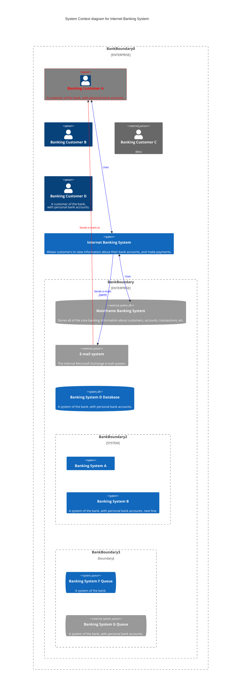

# Mermaid




```mermaid
flowchart TD
   subgraph "TEST.gitlab-ci.yml"
   s1[lint-job] --- s2[depcheck-job]
   s2 --- s3[unit-test-job]
   end
   subgraph "BUILD.gitlab-ci.yml"
   b1[build-job] -.- a3["Update TEST.gitlab-ci.yml"] --&gt; s1
   end
   subgraph "DEPLOY.gitlab-ci.yml"
   d1[deploy-testing-job]
   d3[deploy-final-job]
   end
   subgraph ".gitlab-ci.yml"
   d1 --> d2[wait-for-webapp-ready-job]
   r1[e2e-test-job] --> r2[e2e-report-job]
   p1[publish-app-job] --> p2[pull-deploy-artefact]
   end
   subgraph "Webapp-Compliance"
     subgraph "Static-test"
     s3 -.-> j4[ship-fortify-sast-fod-with-report*]
     j4 --- j5[ship-nexus-iq-scan*]
     j5 --- j6[ship-sonarqube-scan*]
     end
     subgraph "Sign"
     j9[sign-artefact-job]
     end
     subgraph ".pre"
     j1[secret_detection] --- j2["dependency_scanning* (if any)"]
     j2 --- j3["sast* (if any)"]
     j3 -.- a2["Update BUILD.gitlab-ci.yml"] -.-> b1
     end
     subgraph "Runtime-test"
     d2 -.-> j7[dast*]
     j7 --- j8[ship-fortify-dast*]
     j8 -.-> r1
     end
     subgraph "Deploy-to-prod"
     p2 -.-> j10[verify-job]
     j10 --- j11[verify-artefact-signature]
     j11 --- j12[scan-verified-job*]
     j12 -.-> d3
     end
   end
   subgraph "DEPLOY.gitlab-ci.yml"
   j6 -.- a4["Update DEPLOY.gitlab-ci.yml"] -.-> d1
   end
   subgraph ".gitlab-ci.yml"
   r2 -.-> j9
   j9 -.-> p1
   end
   n1([start]) --- a1["Update variables in .gitlab-ci.yml and project's CICD settings"] --> j1
   d3 --> n2([end])
   classDef default fill:#ffd,stroke:#cc7;
   classDef A fill:#ddd,stroke:#eee;
   class a1,a2,a3,a4 A;
   classDef F fill:#fff,stroke:#226;
   class .gitlab-ci.yml,BUILD.gitlab-ci.yml,TEST.gitlab-ci.yml,DEPLOY.gitlab-ci.yml F;
   classDef C fill:#fff,stroke:#226,stroke-dasharray: 5 5;
   class Webapp-Compliance,.pre,Static-test,Runtime-test,Sign,Deploy-to-prod C;
   classDef N fill:#eef,stroke:#226;
   class n1,n2 N;
flowchart LR
 subgraph "Legend"
 direction LR
 n1(start) --- a1["user's task"] ---&gt; j1
 j1 -...-> j2
 j3 --> n2(end)
   subgraph "Compliance-Framework"
     subgraph "Stage"
     j2[optional-job*] --> j3[job]
     end
   end
   subgraph "File"
   direction LR
   j1[job]
   end
 end
   classDef J fill:#ffd,stroke:#cc7;
   class j1,j2,j3 J;
   classDef A fill:#ddd,stroke:#eee;
   class a1 A;
   classDef F fill:#fff,stroke:#226;
   class File,Legend F;
   classDef C fill:#fff,stroke:#226,stroke-dasharray: 5 5;
   class Compliance-Framework,Stage C;
   classDef N fill:#eef,stroke:#226;
   class n1,n2 N;

   ```

   ```mermaid
graph TD;
   A-->B;
   A-->C;
   B-->D;
   C-->D;
```
