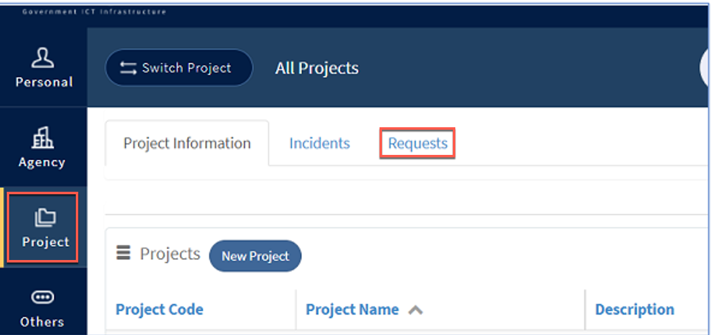
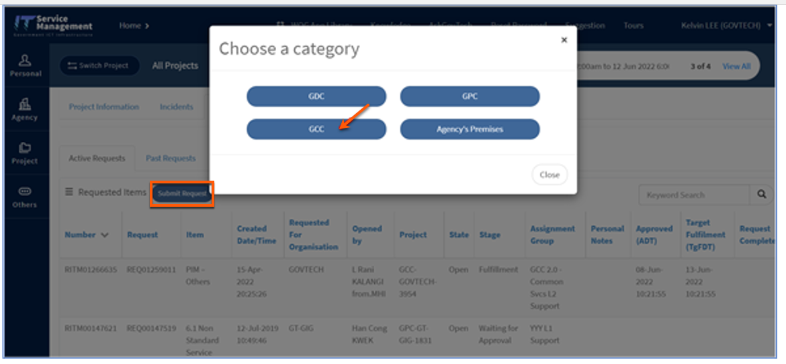

# Raise a service request
This article guides how to raise a service request on ITSM for GCC 2.0.

**Prerequisite**: [ITSM project for GCC 2.0](support/create-itsm-project).

1. From your GSIB device, go to [ITSM portal](https://itsm.sgnet.gov.sg/sp3).
1. Go to **Project** > **Requests**.

> **Note**
>- If your agency does not have a GCC 2.0 project on ITSM, you will not see the **project** tab. Refer to [Create ITSM project](support/create-itsm-project).

3. Select **Submit Request** > **GCC** > **GCC 2.0**. List of service requests that are supported currently are listed.

> **Note**
>- Time required to complete a service request is displayed on the request form.

4. Select the required service request and provide the required details before submitting your service request.

**Related topics**:
- [GCC 2.0 support](https://docs.developer.tech.gov.sg/docs/overview-of-gcc-version-2/#/support)
- [Raise an incident request](support/raise-an-incident-request)
