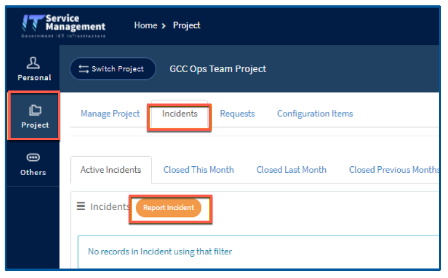

# Raise an incident request
This article guides how to raise an incident support request on ITSM for GCC 2.0.

**Prerequisite**: [ITSM project for GCC 2.0](support/create-itsm-project).

1. From your GSIB device, go to [ITSM portal](https://itsm.sgnet.gov.sg/sp3).
1. Go to **Project** > ***GCC 2.0 &lt;agency name&gt;*** > **Incidents**.

> **Note**
> If you are unable to locate the ***GCC 2.0 &lt;agency name&gt;***, go to **Project** > **Requests**> **Submit Request**  
If your agency does not have a GCC 2.0 project on ITSM, refer to [Create ITSM project](create-itsm-project)

3. In **Active Incidents**, select **Report Incident**.

4. Fill in the incident details and click **Submit**.

**Related topics**:
- [GCC 2.0 support](https://docs.developer.tech.gov.sg/docs/overview-of-gcc-version-2/#/support)
- [Raise service request](raise-a-service-request)
